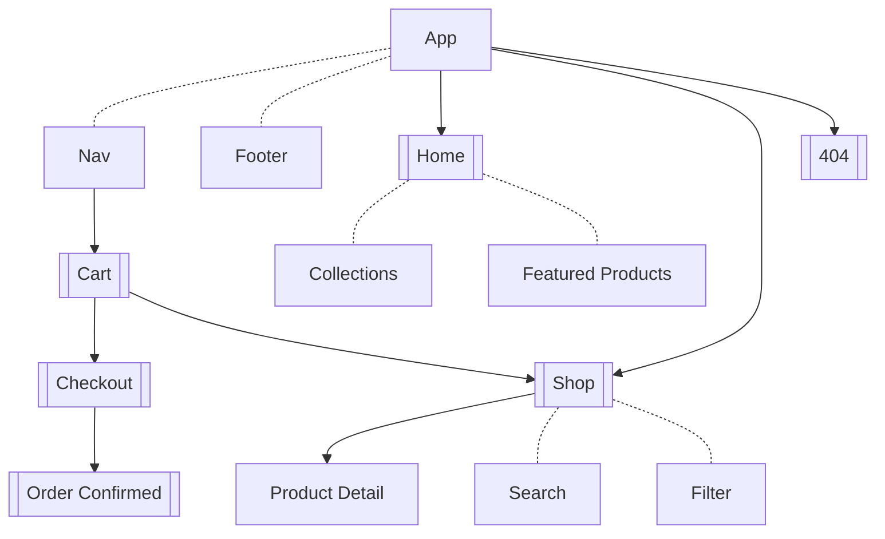
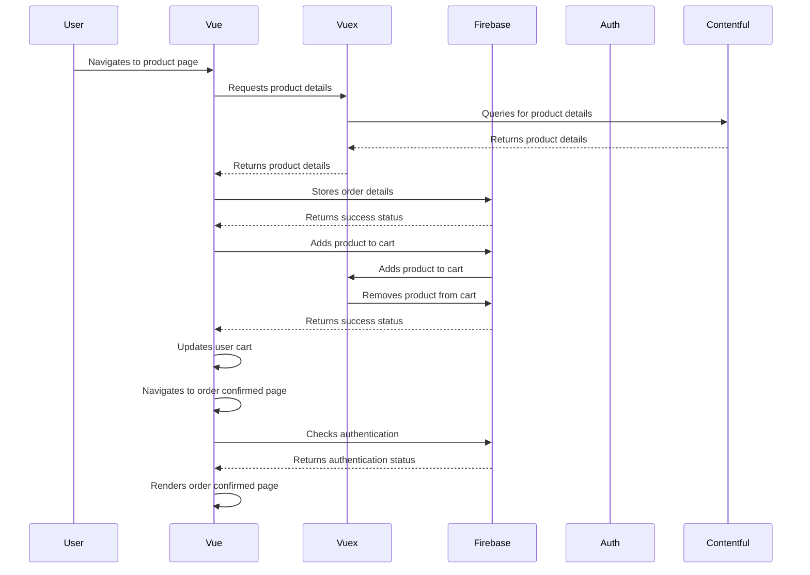

# Technical Documentation for Vue E-commerce App

## Introduction

This is a full-stack e-commerce application built using Vue.js and Vuex as the frontend framework, and Firebase and Contentful as the backend services.

The application includes a cart, product, and user module, and allows users to browse products, add them to their cart, and place orders.

## Architecture

The app is built on top of Vue.js, a popular JavaScript framework for building user interfaces. Vuex is used for state management and to manage the application's data. Vue Router is used for routing and navigation within the application. Firebase is used for backend data storage, authentication, and hosting. Contentful is used for content management and delivery.

<br>

- ## User Flow



<br>

- ## Sequence diagrams



## Usage

### Browsing products

- The homepage displays a list of all featured products and collections.
- Clicking on a product takes you to the product details page, which displays more information about the product.
- Products can be filtered by category using the category filter in the sidebar inside the `/shop` page.

### Adding items to the cart

- To add a product to the cart, click the "Add to Cart" button on the product details page or the iconbutton in the product card.
- The cart can be viewed by clicking the cart icon in the header.
- If you are not logged in, you will be prompted to log in or create an account.

### Placing an order

- To place an order, click the "Checkout" button in the cart.
- After logging in, fill in your shipping information and click "Place Order" to complete the checkout process.

## Prerequisites

Before you begin, make sure you have the following installed on your machine:

- Node.js v10.0 or higher
- Vue CLI v4.0 or higher

## Installation

### Clone the repository

```bash
git clone https://github.com/NaimCode/ecom-vue-sqli.git
```

### Install dependencies

```bash
cd ecom-vue-sqli
npm install
```

## Configuration

1. Create a new Firebase project and enable the Authentication, hosting and Firestore services.
2. Create a new Contentful space and define the required content models.
3. Create a .env file in the root directory of the project and add the following variables:

   ```js
   VUE_APP_FIREBASE_API_KEY=<your-firebase-api-key>
   VUE_APP_FIREBASE_AUTH_DOMAIN=<your-firebase-auth-domain>
   VUE_APP_FIREBASE_DATABASE_URL=<your-firebase-database-url>
   VUE_APP_FIREBASE_PROJECT_ID=<your-firebase-project-id>
   VUE_APP_FIREBASE_STORAGE_BUCKET=<your-firebase-storage-bucket>
   VUE_APP_FIREBASE_MESSAGING_SENDER_ID=<your-firebase-messaging-sender-id>
   VUE_APP_FIREBASE_APP_ID=<your-firebase-app-id>
   VUE_APP_CONTENTFUL_SPACE_ID=<your-contentful-space-id>
   VUE_APP_CONTENTFUL_ACCESS_TOKEN=<your-contentful-access-token>
   ```

   Replace the placeholders with your own values.

4. To start the development server, run:

   ```bash
   npm run serve
   ```

5. To build the application for production, run:

   ```bash
   npm run build
   ```

6. To deploy the application to Firebase, run:

   ```bash
    npm run deploy
    ```
